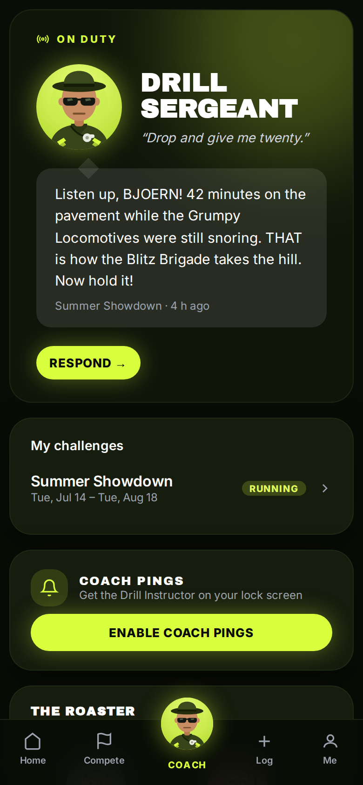
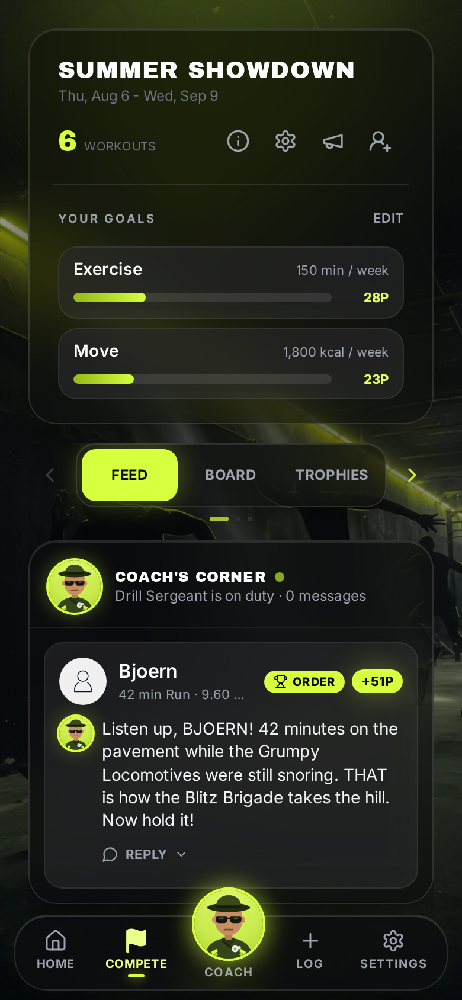
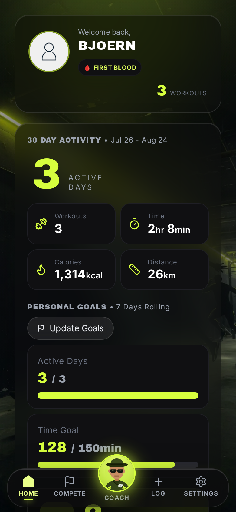

# Workout Challenge

> ### ⚠️ This is a fork
> **Original project:** [vanalmsick/workout_challenge](https://github.com/vanalmsick/workout_challenge) — Copyright © 2025 [github.com/vanalmsick](https://github.com/vanalmsick).
> This fork is maintained at [bandulix/workout_challenge](https://github.com/bandulix/workout_challenge).
> Both are licensed under the **Server Side Public License v1 (SSPL)** — see [LICENSE](LICENSE) and [NOTICE](NOTICE). What this fork changes: [CHANGELOG.md](CHANGELOG.md) and [below](#changes-from-the-original).
>
> 🤖 This fork was vibe-coded — designed and built with AI assistance, guided and reviewed by a human.

An **AI Drill Instructor** comments on every workout, remixes your photos, and pings your lock screen. Self-hosted fitness rivalries on the metrics you choose — kilometres, minutes, calories, steps — imported from **Strava, Garmin, or Health Connect**. Native **Android app** and installable **PWA**. Your data stays on your server.

- **A coach, not a spreadsheet.** Personas roast, cheer, and nudge. Order of the Day, Hall of Roasts, Legend Echoes, weekly coach vote. Add a photo for +10P — the coach remixes it onto the card, not into the chat.
- **Any watch, no lock-in.** Strava, Garmin Connect, or Apple Health / Google Health Connect. One source per athlete so nothing is counted twice.
- **Your rules.** Custom goals, teams, caps, and a live leaderboard — 1 point per 1% of a goal.
- **Yours to host.** Docker Compose. PWA on any phone; sideload APK for one-tap Health Connect.

<p align="center">
  <a href="docs/imgs/preview-mobile-coach-dark.png"></a>
  <a href="docs/imgs/preview-mobile-competition-dark.png"></a>
  <a href="docs/imgs/preview-mobile-myspace-dark.png"></a>
</p>
<p align="center"><i>Coach, challenge feed, and Home.</i></p>

## Run it

```bash
git clone https://github.com/bandulix/workout_challenge.git
cd workout_challenge
cp .env.example .env    # set POSTGRES_PASSWORD and SECRET_KEY
docker compose up -d    # pulls ghcr.io/bandulix/workout_challenge
```

Set `HOSTS` / `MAIN_HOST` to your public URL and `DEBUG=false` in production. The Android app also needs `https://localhost` in `HOSTS`. Migrations run at container start.

Update: `git pull && docker compose pull workoutchallenge && docker compose up -d`.

Releases are deliberate — **Actions → Production Deployment → Run workflow**. Merging to `main` does not tag or publish. Image: [`ghcr.io/bandulix/workout_challenge`](https://github.com/bandulix/workout_challenge/pkgs/container/workout_challenge). Upstream Docker Hub (`vanalmsick/workout_challenge`) is the original app, not this fork.

Tests: `cd src-backend && DEBUG=true SECRET_KEY=ci-test-not-a-real-secret-32bytes-min python manage.py test --settings=workout_challenge.test_settings --top-level-directory=.`

## Optional setup

**Admin** — the first registered user is staff. Runtime config (LLM, Strava, SMTP) is at `/admin/site-settings`. Promote someone: `docker compose exec workoutchallenge python manage.py promotetostaff user@example.com`.

**Email** — SMTP in `.env` / Site Settings. New accounts get a confirmation link first; welcome, weekly, and board mail wait until the address is confirmed. Password reset still works on an unconfirmed account.

**AI coach** — challenge owner: megaphone on the challenge page → pick a persona → activate. Any OpenAI-compatible LLM in Site Settings. Push: Coach page → Enable coach pings (native notifications inside the Android app).

**Strava** — [create an API app](https://www.strava.com/settings/api). Since June 2026 Strava requires a paid subscription for Standard-Tier API access; Health Connect needs no Strava at all.

**Garmin** — link in Settings. The password is used once; only an encrypted token is stored.

**Apple Health / Google Health Connect** — no cloud API, so this stack can run a self-hosted [Open Wearables](https://github.com/the-momentum/open-wearables) instance (MIT, © Momentum; not vendored here — see [NOTICE](NOTICE)):

```bash
# .env: OW_POSTGRES_PASSWORD
docker compose --profile health up -d
```

Phones reach it at `MAIN_HOST/health` by default. In the Android app, Health Connect is one tap. In a browser, Settings shows a connection code for a health app on the phone.

**Android APK** — `scripts/build_apk.sh` (or the APK on each GitHub Release). One APK works on every instance: enter the server address on first start. After pulling a new image: `scripts/update_apk_from_release.sh`.

## Changes from the original

This fork extends [vanalmsick/workout_challenge](https://github.com/vanalmsick/workout_challenge) (base `main` @ `256e5b1`) under the same SSPL v1. Original copyright is untouched. Full list: [CHANGELOG.md](CHANGELOG.md).

- **AI Drill Instructor** — persona-voiced comments, quiet-day nudges, Order of the Day, dunce, Hall of Roasts, Legend Echoes, weekly coach vote, photo posts, web push / native Android pings.
- **Coach-centred PWA** — volt accent, glass dock, Coach as home, daily action plates, dark theme, profile pictures. Uploaded photos stay private (login required; never a public `/media/` URL). Mail uses the same identity; new inboxes must confirm before welcome / weekly mail.
- **Garmin Connect** and **Apple Health / Health Connect** (via Open Wearables) next to Strava; one activity source per user.
- **Sideload Android app** with one-tap Health Connect.

License: [LICENSE](LICENSE) (SSPL v1). Fork and third-party notices: [NOTICE](NOTICE).
