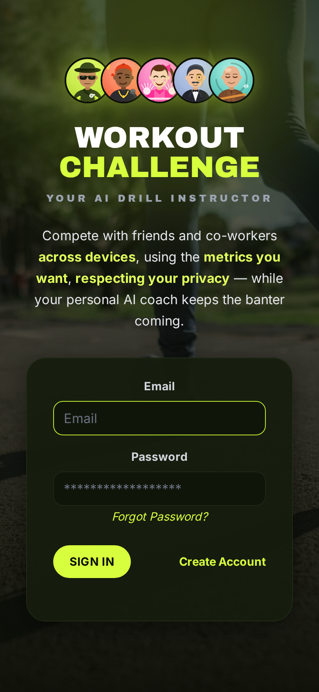

# Workout Challenge

> ### ⚠️ This is a fork
> **Original project:** [vanalmsick/workout_challenge](https://github.com/vanalmsick/workout_challenge) — Copyright © 2025 [github.com/vanalmsick](https://github.com/vanalmsick).
> This fork is maintained at [bandulix/workout_challenge](https://github.com/bandulix/workout_challenge).
> Both are licensed under the **Server Side Public License v1 (SSPL)** — see [LICENSE](LICENSE). What this fork changes: [CHANGELOG.md](CHANGELOG.md), [NOTICE](NOTICE), and [below](#changes-from-the-original).
>
> 🤖 Full transparency: **this fork was vibe-coded** — designed and built with AI assistance (OpenCode + LLMs), guided and reviewed by a human.

Turn staying active into a rivalry your friends actually care about. Compete with friends and co-workers on the metrics you choose — kilometres, minutes, calories, steps — from any device, with your privacy fully intact. Workouts import themselves from Strava or Garmin Connect, teams and leaderboards keep the score honest, and your personal **AI Drill Instructor** — voiced by a persona you pick — comments on every workout, nudges quiet groups, and pings your lock screen when the banter demands it. Self-hosted. Installable as a PWA. Entirely yours.

<p align="center">
  <a href="docs/imgs/preview-mobile-login-dark.png"></a>
  <a href="docs/imgs/preview-mobile-competition-dark.png"></a>
  <a href="docs/imgs/preview-mobile-coach-dark.png"></a>
</p>
<p align="center"><i>The PWA on a phone: login, the competition with its AI coach, and the coach wire.</i></p>

**Contents:** [Changes from the original](#changes-from-the-original) · [How it works](#how-it-works) · [Getting started](#getting-started) · [AI Drill Instructor](#ai-drill-instructor) · [Admin & site settings](#admin--site-settings) · [Mobile app & push](#mobile-app--push-notifications) · [Apple / Google Health](#apple--google-health-open-wearables) · [Android app](#android-app-sideload-apk) · [Strava API credentials](#strava-api-credentials)

## Changes from the original
This fork extends [vanalmsick/workout_challenge](https://github.com/vanalmsick/workout_challenge) (base: `main` @ `256e5b1`). Everything remains under the same SSPL v1 license; the original copyright is untouched.

**🎖️ AI Drill Instructor (new feature)**
- Per-competition, owner-configured AI coach that comments on every logged workout in a chosen persona voice (any OpenAI-compatible LLM provider; runtime-configurable in Site Settings).
- Personas have **profile pictures, taglines and accent colours** — 10 hand-crafted avatar artworks ship in `src-frontend/public/personas/`; custom personas can pick artwork or an emoji.
- Messages live in an in-app audit log (REST: `/api/drill-instructor/*`) and can be pushed to athletes' devices via web push.
- **Quiet-day nudges:** if a running competition sees zero workouts in a day, the instructor posts one motivational, group-addressed message on its own (daily sweep, per-competition toggle).

**📱 Coach-centred PWA redesign (mobile-first)**
- Dark athletic "volt/ink" theme, self-hosted Archivo Black + Inter fonts, class-based dark mode with manual toggle.
- **Coach page** (`/coach`): persona hero, live chat-style coach feed, persona roster, platform-aware push opt-in.
- Bottom-bar navigation (floating dock on desktop) with the coach persona at centre stage; installable PWA with offline shell and push on iOS & Android.

**🏠 Home / profile**
- Redesigned dashboard with compact **Streak Card**; 30-day stats and personal-goal blocks.
- **Profile picture upload** (editable avatar, old files auto-deleted).

**⌚ Garmin Connect import (new connector, parallel to Strava)**
- Link Garmin in Settings; the password is used once and never stored — only the encrypted OAuth token blob (Fernet) is kept. Daily sync plus manual re-sync; ~60 activity types mapped; de-duplication by activity id.

**🍎🤖 Apple Health / Health Connect import (new connector, Strava-optional)**
- Import workouts **straight from Apple Health or Google Health Connect** — no Strava account (or subscription) needed. Since Apple/Google expose no cloud API, a self-hosted [Open Wearables](https://github.com/the-momentum/open-wearables) instance (MIT) receives the on-device data from a health app on the athlete's phone; this connector polls it hourly, like the other providers. Same one-source-per-user selector, same cross-provider duplicate guard. See [Apple / Google Health](#apple--google-health-open-wearables).

**🤖 Native Android app (sideload APK, Health Connect built in)**
- The PWA also ships as a Capacitor **Android app** with the Open Wearables SDK bridged in: Health Connect linking is one tap, coach pings arrive as real Android notifications, the activity-source selector drives the phone-side sync, and an in-app banner announces updates. Every GitHub Release builds and attaches a matching generic APK (works on any instance after a one-time server entry); see [Android app](#android-app-sideload-apk).

**🔐 Access & invites**
- Optional `REGISTRATION_TOKEN` invite gate; a competition invite link (`?join=<code>`) doubles as the registration invite, so invitees sign up token-free.
- **First-user-is-admin** bootstrap; **Site Settings** runtime admin (LLM / Strava / SMTP, DB-over-env resolution, write-only secrets).

## How it works
Create a competition or join one via a friend's invite link, log workouts manually or import them automatically, and customize the competition's activity goals. Participants earn 1 point per 1% progress towards a goal (100 min goal + 50 min workout = 50 points). Points can be capped/floored per workout / day / week to keep the competition healthy and consistency-focused.

**Features:**
- Competitions with custom goals, teams, leaderboards and weekly email recaps
- **AI Drill Instructor** with persona avatars — comments on every workout, nudges quiet groups, optionally pings phones via push
- **Coach page** — a live, chat-style feed of everything the coach has said
- Workout entry manually or via Strava / Garmin Connect auto-import
- Personal dashboard with workout stats, streak card and personal goals
- Installable PWA (offline shell, push notifications), light & dark mode, mobile-first

**Competition goal choices:**
- **Metrics:** time (min) / count (#) / distance (km) / calories (kcal) / kilojoules (kj)
- **Period:** per day / week / month / entire competition
- **Limits:** min / max per workout, per day, per week

## Getting started
All configuration lives in [`.env.example`](.env.example) (every variable, with comments) and [`docker-compose.yml`](docker-compose.yml):

```bash
git clone https://github.com/bandulix/workout_challenge.git
cd workout_challenge
cp .env.example .env    # then edit: at minimum POSTGRES_PASSWORD and SECRET_KEY
docker compose up -d    # pulls the pre-built image - no local build needed
```

The stack starts nginx (app on port 80), Django/gunicorn, Celery worker + beat, Redis and Postgres. In production set `HOSTS` / `MAIN_HOST` to your public URL and `DEBUG=false`. Migrations and static files are handled automatically at container start.

**Reverse proxy (production on a VPS)** — bind the app to localhost only and terminate TLS in front, e.g. `APP_BIND=127.0.0.1` `APP_PORT=8080` in `.env`, then point your proxy at it. Complete nginx example (app + optional Open Wearables for the health connector):

```nginx
server {
    listen 443 ssl;
    server_name workout.your-domain.com;
    # ssl_certificate / ssl_certificate_key ...

    # The app itself (web UI + API)
    location / {
        proxy_pass http://127.0.0.1:8080;
        proxy_set_header Host $host;
        proxy_set_header X-Forwarded-Proto $scheme;
        proxy_set_header X-Forwarded-For $proxy_add_x_forwarded_for;
    }

    # Optional: Open Wearables (health profile) - phones must reach it.
    # Recommended: this path route on the app domain (one cert, no extra
    # DNS); alternative: its own server_name (health.your-domain.com).
    location /health/ {
        proxy_pass http://127.0.0.1:8001/;   # trailing slash strips the prefix
        proxy_set_header Host $host;
        proxy_set_header X-Forwarded-Proto $scheme;
    }
}
```

Matching `.env` entries: `MAIN_HOST=https://workout.your-domain.com`, `HOSTS=https://workout.your-domain.com,https://localhost` (the `https://localhost` origin is needed by the Android app), and for the health connector `HEALTH_PUBLIC_URL=https://workout.your-domain.com/health` (or the subdomain variant — see [Apple / Google Health](#apple--google-health-open-wearables)).

The pre-built multi-arch image (amd64 + arm64) comes from [`ghcr.io/bandulix/workout_challenge`](https://github.com/bandulix/workout_challenge/pkgs/container/workout_challenge) and is rebuilt on every release. Use `docker compose up -d --build` to build from source instead (e.g. after changing code). *(The `vanalmsick/workout_challenge` image on DockerHub ships the original upstream app, not this fork.)*

## AI Drill Instructor
Each competition can optionally activate an AI coach that generates a short, persona-voiced comment for every logged activity, stores it in an in-app audit log, and optionally pushes it to athletes' devices.

**Enable it (competition owner):**
1. On the competition page, open **Coach's Corner → Configure** (owner only).
2. Pick a persona, toggle **Activate the Drill Instructor**, save — use the built-in test message to verify.

**What it does:**
- Comments on every workout in the competition, in the persona's voice.
- **Random daily push:** 1-2 times per day at random times (07:00–22:00) the instructor posts a pep talk pushing the whole group (toggleable per competition).
- **Quiet-day nudge:** if a whole day passes without any workout in a running competition, the instructor posts one motivational nudge to the group (toggleable per competition).
- With browser push enabled, messages are also dispatched to subscribed devices (nudges go to every participant).

**Built-in personas** (each with profile picture, tagline and accent colour):

| Persona | Style |
| --- | --- |
| **Drill Sergeant** | Tough-love military barking. Roasts laggards, mocks the leader, rallies the platoon. |
| **Roast Master** | Savage but affectionate NBA-banter energy. Playful sarcasm, 1-2 emojis. |
| **Cheerleader** | Endless enthusiasm, capital letters, emojis, always positive. |
| **British Butler** | Dry, polite, devastating one-liners. |
| **Zen Master** | Calm and philosophical, focused on inner balance. |

Owners can also create custom personas (shipped artwork or an emoji, accent colour, own system prompt). Any OpenAI-compatible provider works — pick a preset or paste base URL + key in **Site Settings → LLM / AI Provider**.

## Admin & site settings
The **first user to register** is automatically promoted to staff + superuser. The admin page (`/admin/site-settings`) edits runtime configuration — LLM provider, Strava, SMTP — with **database-over-env** resolution, so changes apply without restarts. Secrets are write-only on the API (masked preview only).

Promote another user to admin:
```bash
docker compose exec -w /workout_challenge/src-backend workoutchallenge python manage.py promotetostaff user@example.com
```

## Mobile app & push notifications
- **Installable PWA** — iOS: Share → "Add to Home Screen"; Android: install banner. Standalone display, offline shell, safe-area aware.
- **Push notifications** — the coach pings your device with the persona's avatar as the icon:
  1. Install the app (required on iOS 16.4+).
  2. **Coach page → "Enable coach pings"**.
  3. Per competition: **AI Drill Instructor → "Browser push for participants"**.
- VAPID keys are auto-generated on first start (`DATA_DIR/vapid.json` — don't lose it) or pinned via env vars.
- **Inside the Android app**, coach pings arrive as **native Android notifications** instead (Web Push doesn't work in a WebView): the app polls the coach feed and notifies on new coach messages — no Firebase, no server config.

## Apple / Google Health (Open Wearables)
Apple HealthKit and Google Health Connect keep workouts **on the phone** — there is no cloud API any server could poll. This stack therefore bundles a full [Open Wearables](https://github.com/the-momentum/open-wearables) instance (MIT, self-hosted) as an **opt-in compose profile** — same `docker-compose.yml`, nothing separate to deploy:

1. In `.env`: set `OW_POSTGRES_PASSWORD`. That's it — phones reach Open Wearables via the app's own domain by default (see below).
2. `docker compose --profile health up -d` — the first start builds the Open Wearables image from a pinned upstream commit.
3. Done — the connector logs into Open Wearables with the seeded admin developer (defaults `admin@example.com` / your `SECRET_KEY`, overridable via `OW_ADMIN_*` or Site Settings → Health); the backend reaches the API at the internal `http://openwearables:8000` by default.

Athletes then open **Settings → Apple / Google Health → Connect Health App**, which shows a single-use connection code; they enter host + code in the health app on their phone (Open Wearables example/official app, or any app built with its SDK), and workouts start flowing — hourly poll, plus a manual **Re-Sync** button on Home. The activity-source selector (Settings) decides which provider imports when several are linked, and the cross-provider duplicate guard still applies.

**How phones reach Open Wearables** — the container's nginx serves the OW API under the app's own domain at **`/health/`** (proxied to the `openwearables` container), and `HEALTH_PUBLIC_URL` defaults to `MAIN_HOST + /health`. One domain, one certificate, no extra proxy rules — your outer reverse proxy (if any) just keeps forwarding everything to the app. This also fixes the classic failure mode: a LAN IP or the internal docker hostname in `HEALTH_PUBLIC_URL` is unreachable from mobile data ("host not found" in the app), and plain-HTTP hosts get mixed-content-blocked by the HTTPS app. Only set `HEALTH_PUBLIC_URL` if you deliberately expose OW elsewhere (e.g. a dedicated `https://health.your-domain.com` via your own reverse proxy, no prefix rewriting then).

**License:** Open Wearables is **MIT-licensed** (© 2025 Momentum) — permissive and compatible with this project's SSPL v1: it runs as a separate, unmodified service built from its pinned upstream source on your machine; nothing of it is vendored into this repository, so no obligations arise for this project's code. Attribution lives in [`NOTICE`](NOTICE). Should you ever fork its mobile example app or distribute a built image of it, keep its `LICENSE` file (with the MIT copyright notice) included, as MIT requires.

## Android app (sideload APK)
The whole PWA also ships as a native **Android app** (Capacitor shell around the same web build) with the **Open Wearables Android SDK built in** — so on Android, *Settings → Apple / Google Health → Connect Health Connect* becomes a **one-tap** flow: the app redeems the connection code itself, shows the Health Connect permission dialog and starts background sync. No second app, no code typing.

**Server address:** one APK works on every instance — the app asks for the **server address once on first start** (an APK can't know where it was downloaded from). When built via `scripts/build_apk.sh` with `MAIN_HOST` set in `.env`, that address is pre-filled and the phone just confirms it; build with `MAIN_HOST` unset for a fully generic APK. Either way, the backend's `HOSTS` must allow the app's `https://localhost` origin (CORS).

**Build it:**

```bash
scripts/build_apk.sh            # release APK (signed, see below)
scripts/build_apk.sh --debug    # faster debug build
# → src-frontend/android/app/build/outputs/apk/release/app-release.apk
```

Toolchain (once per build machine): JDK 21 (e.g. `~/jdk21`) + Android SDK platform-36 (e.g. `~/Android/Sdk`); `npm ci` in `src-frontend`.

- **Install:** the script also **publishes the APK onto your stack** — nginx serves it at `/download/workout-challenge.apk` (volume-backed, survives recreations), and *Settings → Apple / Google Health* offers that download to Android browsers automatically. Manual alternative: copy the APK to the phone. On the phone: "Install unknown apps" once → enter the server address on first start → log in → Settings → Connect Health Connect.
- **Signing:** release builds sign with `~/.gradle/workout-signing.properties` (generated once, lives outside the repo); without it they fall back to the debug key so `assembleRelease` always works. **Keep the release keystore safe** — updates must be signed with the same key.
- **Updates:** the script stamps every build with `versionName` (git tag) + `versionCode` (commit count, monotonic) and publishes `apk-version.json` next to the APK. The app compares it to its own build and shows a **"App update available" banner** on the dashboard when yours is newer — tap → download → Android installs over the top, all data kept. Dismissing hides the banner until the *next* newer build.
- **Releases ship the APK automatically:** the CI (`apk` job in `prod-deploy.yml`) builds a **generic APK** on every release and attaches it (+ `apk-version.json`) to the GitHub Release — so the app always matches the deployed version. After pulling a new image, run `scripts/update_apk_from_release.sh` to fetch it onto your stack (cron-friendly; pass a tag for a specific release). Locally built APKs via `build_apk.sh` stay the pre-filled alternative.
- **Activity source switching:** the Settings selector (Strava / Garmin / Google Health Connect) also drives the phone-side sync in the app — Health starts it, anything else pauses it, and switches made on other devices reconcile on the next app start.
- **Play Store later:** `./gradlew bundleRelease` produces the AAB; Health Connect permission declaration + privacy policy are the remaining store chores.

## Strava API credentials
1. Log in at [strava.com/login](https://www.strava.com/login) → profile picture → **Settings** → **My API Application**.
2. Create the app to get your Client ID & secret (works with your own account immediately).
3. To let other users link their Strava, apply to the [Strava developer program](https://share.hsforms.com/1VXSwPUYqSH6IxK0y51FjHwcnkd8).

> **Since June 2026 Strava requires an active paid subscription** for Standard-Tier API access — which can extend to the athletes connecting (API Policy §3.3). If a user's linking fails on Strava's side, a missing subscription is the most likely cause; the Settings page notes this, and the Apple/Google Health connector needs no Strava at all.
