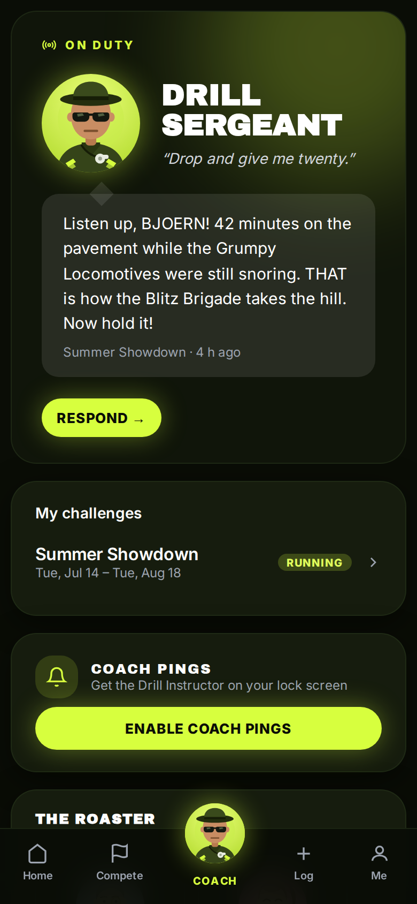
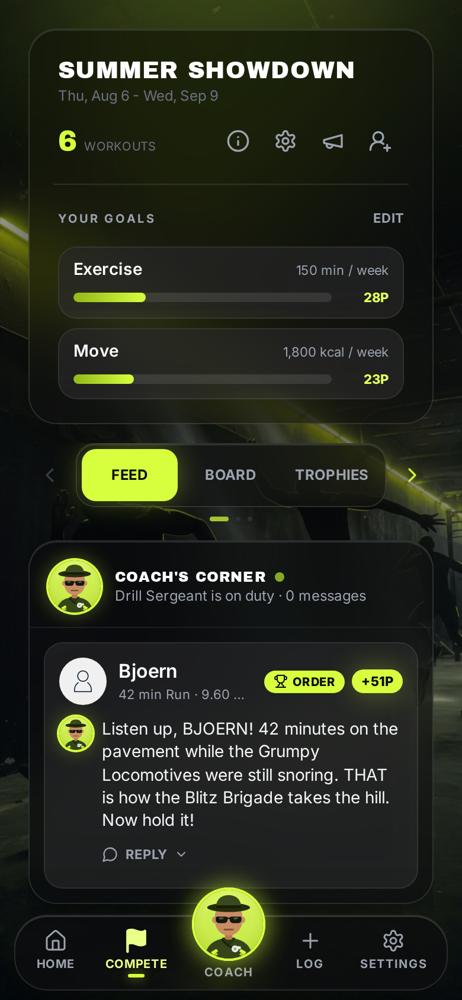
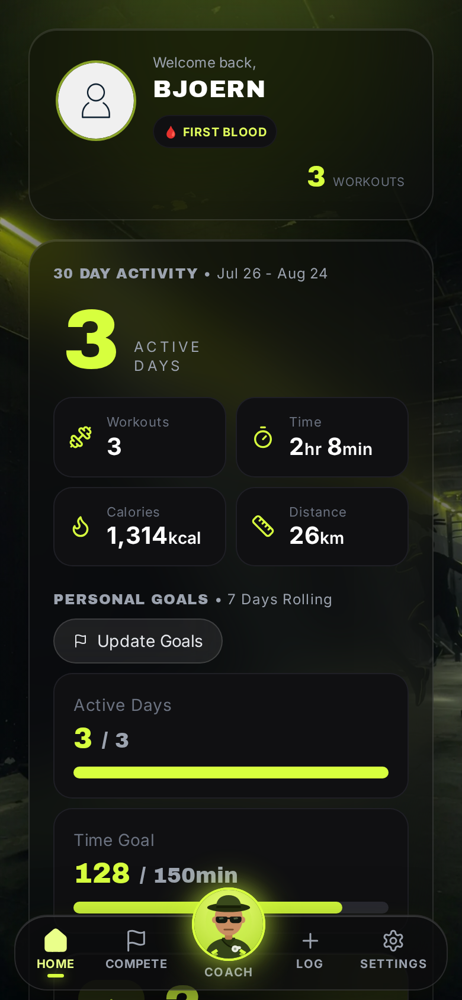

# Workout Challenge

> ### ⚠️ This is a fork
> **Original project:** [vanalmsick/workout_challenge](https://github.com/vanalmsick/workout_challenge) — Copyright © 2025 [github.com/vanalmsick](https://github.com/vanalmsick).
> This fork is maintained at [bandulix/workout_challenge](https://github.com/bandulix/workout_challenge).
> Both are licensed under the **Server Side Public License v1 (SSPL)** — see [LICENSE](LICENSE) and [NOTICE](NOTICE). What this fork changes: [CHANGELOG.md](CHANGELOG.md) and [below](#changes-from-the-original).
>
> 🤖 This fork was vibe-coded — designed and built with AI assistance, guided and reviewed by a human.

An **AI Drill Instructor** comments on every workout, remixes your photos, and pings your lock screen. Self-hosted fitness rivalries on the metrics you choose — kilometres, minutes, calories, steps — imported from **Strava, Garmin, or Health Connect**. Native **Android app** and installable **PWA**. Your data stays on your server.

- **A coach, not a spreadsheet.** Personas roast, cheer, and nudge — and always answer a photo with a remix. Stamp a workout (WTF!, GOAT, Oof, …). Order of the Day, Hall of Roasts, Legend Echoes (beat the mark, take the relic — 3 takeovers make it immortal; the photo *is* the relic), weekly coach vote in the last 72 hours before Monday. Owners can give the coach a daily briefing topic, and custom coaches get a portrait plus full-body photos so remixes look like them.
- **Expedition.** Turn a challenge into a shared route: the crew's points move everyone along a themed trail (summit, ocean, desert, space, relay) with landmarks spread across the challenge dates and a finale on the last day. Rescue runs, base camps, treasure hunts, storm/rope weeks and shortcut votes keep seasons different; a postcard and one-tap rematch close them.
- **Home that moves you.** One named rival and what would close the gap, a private comeback note when your week goes quiet (never a public call-out), and opt-in nudges from challenge-mates.
- **Any watch, no lock-in.** Strava, Garmin Connect, or Apple Health / Google Health Connect. One source per athlete so nothing is counted twice.
- **Your rules.** Custom goals, teams, caps, and a live leaderboard — 1 point per 1% of a goal.
- **Yours to host.** Docker Compose. PWA on any phone; sideload APK for one-tap Health Connect.

<p align="center">
  <a href="docs/imgs/preview-mobile-coach-dark.png"></a>
  <a href="docs/imgs/preview-mobile-competition-dark.png"></a>
  <a href="docs/imgs/preview-mobile-myspace-dark.png"></a>
</p>
<p align="center"><i>Coach, challenge feed, and Home.</i></p>

## Run it

```bash
git clone https://github.com/bandulix/workout_challenge.git
cd workout_challenge
cp .env.example .env    # SECRET_KEY, POSTGRES_PASSWORD, FLOWER_PASSWORD
docker compose up -d    # pulls ghcr.io/bandulix/workout_challenge
```

`FLOWER_PASSWORD` must differ from `SECRET_KEY`. In production set `MAIN_HOST` / `HOSTS` to your public **HTTPS** origin and `DEBUG=false`. Keep `APP_BIND=127.0.0.1` behind a TLS reverse proxy that redirects 80→443 and forwards `X-Forwarded-For` and `X-Forwarded-Proto` (throttles, HSTS and the HTTPS-only link flows key on them). The Android app also needs `https://localhost` in `HOSTS`. Migrations run at container start. Never run a reachable instance with `DEBUG=true` — it relaxes several security controls at once (the app logs a warning if you do).

Update: `git pull && docker compose pull workoutchallenge && docker compose up -d`.

Image: [`ghcr.io/bandulix/workout_challenge`](https://github.com/bandulix/workout_challenge/pkgs/container/workout_challenge). The Docker Hub image `vanalmsick/workout_challenge` is the original app, not this fork.

## Optional setup

**Accounts** — with `REGISTRATION_TOKEN` empty, anyone can sign up and the first account is staff. Set a token to close registration, then `docker compose exec workoutchallenge python manage.py createsuperuser` (or `promotetostaff user@example.com`). Challenge invite links (`?join=`) still work. Point factors live at `/admin/site-settings`; LLM, Strava, and SMTP are `.env`-only.

**Email** — SMTP in `.env`. New accounts confirm the address before welcome / weekly mail.

**AI coach** — challenge owner: megaphone on the challenge page → pick a persona → activate. Any OpenAI-compatible LLM via `LLM_*` in `.env` (an image-capable model or a dedicated `LLM_IMAGE_*` model enables photo remixes). Push: Coach page → Enable coach pings.

**Expedition** — challenge owner: Edit challenge → *Expedition* on, pick objective and theme ("Surprise me" rotates). Locked once the route has started; participants see it on the challenge's Trail tab.

**Strava** — [create an API app](https://www.strava.com/settings/api). Since June 2026 Strava requires a paid subscription for Standard-Tier API access; Health Connect needs no Strava at all.

**Garmin** — link in Settings. The password is used once; only an encrypted token is stored.

**Apple Health / Google Health Connect** — no cloud API, so this stack can run a self-hosted [Open Wearables](https://github.com/the-momentum/open-wearables) instance (MIT, © Momentum; not vendored here — see [NOTICE](NOTICE)):

```bash
# .env: OW_POSTGRES_PASSWORD, OW_SECRET_KEY and OW_ADMIN_PASSWORD
# (OW_SECRET_KEY / OW_ADMIN_PASSWORD must differ from Django's SECRET_KEY)
docker compose --profile health up -d
```

Phones reach it at `MAIN_HOST/health` by default. In the Android app, Health Connect is one tap. In a browser, Settings shows a connection code for a health app on the phone.

**Android APK** — GitHub Releases, or `scripts/build_apk.sh`. One APK works on every instance: enter the server address on first start. After pulling a new image, publish the matching APK with `scripts/update_apk_from_release.sh`. Foldables (Galaxy Z Fold/Flip class) are supported: the activity is resizable, survives fold/unfold without losing state, draws around cutouts, and the dock avoids the hinge in dual-screen posture.

Secrets at rest and backup notes: [docs/security-secrets-and-backups.md](docs/security-secrets-and-backups.md). Quick backups (DB + uploads): `scripts/backup.sh` — always before an upgrade.

## Develop

```bash
cd src-backend && python manage.py test --settings=workout_challenge.test_settings   # backend suite
cd src-backend && ruff check .                                                       # backend lint gate (ruff.toml)
cd src-frontend && npm test && npx eslint src                                        # frontend tests + lint
```

Backend migrations for `competition`, `workouts` and `custom_user` live in `src-backend/db_migrations/` (outside the runtime data volume so a named volume can't shadow them). CI gates every push on both suites and builds the Docker image + signed APK on release. Product direction for Expedition and the retention loop: [docs/expedition-product-roadmap.md](docs/expedition-product-roadmap.md).

## Changes from the original

This fork extends [vanalmsick/workout_challenge](https://github.com/vanalmsick/workout_challenge) (base `main` @ `256e5b1`) under the same SSPL v1. Original copyright is untouched. Full list: [CHANGELOG.md](CHANGELOG.md).

- **AI Drill Instructor** — persona comments, stamps, Order of the Day, Hall of Roasts, Legend Echoes on the workout (sport-family relics, takeovers announced, 3 defenses to immortal), weekly coach vote (72h window), photo remixes, owner-defined daily briefings, native share sheet, web push / Android pings.
- **Expedition & seasons** — shared themed routes with objectives and weekly twists, crew view, finale postcard, archive and rematch.
- **Retention without shaming** — Close-the-Gap rival card, private comeback bench with opt-in peer nudges; public dunce/last-place mechanics removed.
- **Coach-centred PWA** — glass dock, Coach as home, daily action plates, dark theme, private uploaded photos.
- **Garmin Connect** and **Apple Health / Health Connect** (via Open Wearables) next to Strava — one shared sport-type table, so the same workout counts the same from every watch; one activity source per user.
- **Sideload Android app** with one-tap Health Connect.

License: [LICENSE](LICENSE) (SSPL v1). Fork and third-party notices: [NOTICE](NOTICE).
